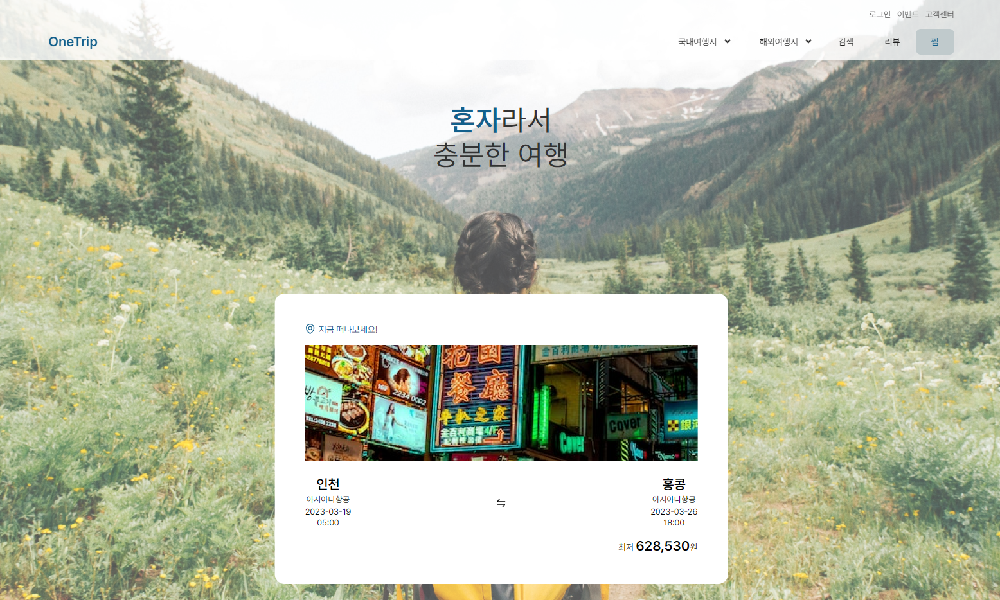

# [리액트앱] 원트립 - One Trip 

![npm-image][npm-image] ![React-image][React-image] ![React-router-dom][React-router-dom] ![axios-image][axios-image] ![sass-image][sass-image]
![antd-image][antd-image]

 

### 🔗 [원트립 바로가기](https://onetrip-kimminjung96.vercel.app/)
### 🔗 [원트립 백앤드 URL 바로가기](https://onetrip-kimminjung96.vercel.app/)
### 🔗 [원트립 백앤드 깃허브 바로가기](https://onetrip-kimminjung96.vercel.app/)

 

-----

 

## 기술 소개
> PWA 앱으로 제작한 풀스택 프로젝트입니다.     
> 
> 프론트는 React로 구현했고,     
> 백엔드는 Node Js의 Express로 서버 구현을,     
> 데이터 베이스는 Sequelize를 사용해 모델링했습니다    

 

## 프로젝트 소개
원트립은 여행을 혼자 즐기는 사람들을 위한 여행 상품 판매 앱입니다.     
문화생활, 맛집탐방, 액티비티, 휴식, 쇼핑 다섯가지 테마에 맞는 여행을 제안하며,     
상품 등록, 품절, 결제, 찜, 검색, 후기 작성 기능을 제공합니다. 

    ****

 

 

## ⏲ 개발 기간
2023년 03월 07일 ~ 2023년 03월 31일

 

## 👀 구성원

🌳 김민정 – [kimminjung96](https://github.com/kimminjung96)     
🌼 김영중 – [Youngjung3](https://github.com/Youngjung3)     
🍀 김인혜 – [ihkim8](https://github.com/ihkim8)     
🌵 정이진 – [ejin1018](https://github.com/ejin1018)     

 

## 🧰 역할 배분

🍀 김인혜: 팀장, 전체 기획 총괄, 기획 자료 수립·정리, Productt(지역명 분류), Login(로그인) 개발      
🌼 김영중: 개발 팀장, 데이터 베이스 구조 수립, 제품 데이터 베이스 설계 및 관리 총괄, 데이터 api 개발, RecomSlider(테마별 분류) 개발     
🌳 김민정: 프론트 팀장, 개발 환경 구성, Create(상품 등록) 개발, 리뷰 데이터 베이스 설계 및 api 개발        
🌵 정이진: 디자인 팀장, 프론트 팀원, SearchPage(상품 검색), Packages(상품 상세) 개발    

 

## 👩‍👩‍👧‍👧 협업
[깃허브 플로우]
1. main 브랜치 잠금
2. 개발 전용 develop 브랜치 생성
3. 개인 브랜치 생성 후 작업
4. develop 브랜치로 이동 후 개인 브랜치 merge
5. develop 브랜치 push
6. 최종 배포시 main 브랜치 push

 

## 💎 구현 목록

#### ReconSlider `테마별 분류`
✔ select 에서 값을 선택     
✔ 선택된 값을 기준으로 데이터 중 theme (테마)와 일치하는 상품을 반환     

#### Productt `지역명 분류`
✔ 데이터 중 p_area (지역명) 을 기준으로 분류된 상품을 반환     

#### Create `상품 등록`
✔ post api 를 이용해 데이터 생성     
✔ 등록 창에서 정보를 입력받아 상품 생성 후 화면에 반환     

#### Packages `상품 상세`
✔ get api를 이용해 데이터 렌더링     
✔ 데이터 중 id 를 이용해 선택된 상품의 정보를 반환     
          
#### SearchPage `상품 검색`
✔ 검색창에 입력 시 상품 이름과 지역 분류에서 동일한 값을 찾아 결과를 반환 

#### SearchPage `상품 찜하기`
✔ get api를 이용해 데이터 렌더링     
✔ 데이터 중 heart를 이용해 선택된 상품에 표시     

 

<!-- Markdown link & img dfn's -->
[npm-image]:https://img.shields.io/badge/npm-v6.9.0-lightgrey?logo=npm
[React-image]:https://img.shields.io/badge/React-v18.2.0-blue?logo=React
[React-router-dom]:https://img.shields.io/badge/React--router--dom-v6.9.0-BLUE?logo=React-Router
[axios-image]:https://img.shields.io/badge/axios-v1.3.4-red?logo=axios
[sass-image]:https://img.shields.io/badge/sass-v1.59.3-orange?logo=sass
[antd-image]:https://img.shields.io/badge/antd-v5.3.0-yellow?logo=antdesign

